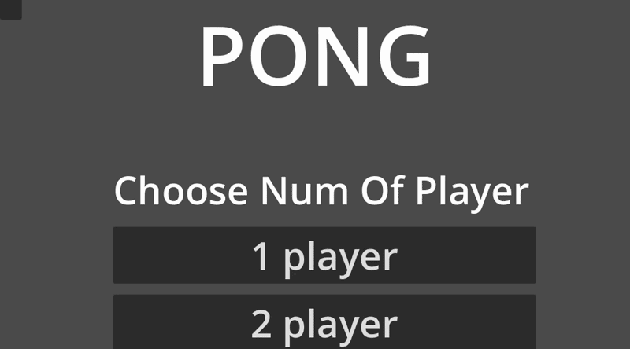

# Pong - Godot 4.x 游戏

经典 Pong 游戏的现代实现，基于 Godot 4.x 引擎和 C# 开发。

## 🎮 游戏展示

以下是游戏游玩过程的演示：



## 🎯 游戏特性

- ✅ 单人模式（vs AI）
- ✅ 双人本地对战模式
- ✅ AI 难度选择（可选择让左边或右边的球拍由 AI 控制）
- ✅ 实时物理碰撞检测
- ✅ 计分系统（先到 5 分获胜）
- ✅ 自定义球体着色器效果
- ✅ 完整的游戏流程（开始界面 → 游戏中 → 结束界面）
- ✅ 重新开始功能

## 🛠 技术栈

- **游戏引擎**: Godot 4.x
- **编程语言**: C# (.NET)
- **渲染方式**: 2D + 自定义 Shader

## 📁 项目结构

```
pong/
├── GameController.cs    # 游戏主控制器（游戏状态、计分、UI管理）
├── Ball.cs              # 球的物理逻辑和碰撞检测
├── PaddleControl.cs     # 球拍控制脚本
├── PaddleAI.cs          # AI 控制逻辑
├── BallShader.gdshader  # 球的视觉效果着色器
└── main.tscn            # 游戏主场景
```

## 🎯 游戏说明

### 操作方式

**单人模式：**
| 玩家 | 上移 | 下移 |
|------|------|------|
| 左侧（玩家） | W | S |
| 右侧（AI） | 自动 | 自动 |

**双人模式：**
| 玩家 | 上移 | 下移 |
|------|------|------|
| 左侧 | W | S |
| 右侧 | ↑ | ↓ |

### 游戏规则

- 球进入对方球门时得分
- 达到 **5 分** 即获胜
- 游戏将暂停并显示胜利信息
- 可点击重新开始按钮再次游戏

## 🚀 运行方式

1. 确保已安装 [Godot 4.x](https://godotengine.org/download) 引擎
2. 使用 Godot 打开项目文件夹
3. 点击运行按钮或按 `F5` 启动游戏

## 📝 核心代码说明

### 游戏状态管理

游戏使用枚举管理三种状态：

```csharp
public enum GameState
{
    StartingScreen,  // 开始界面
    Playing,         // 游戏中
    GameOver         // 游戏结束
}
```

### 碰撞检测（Area2D.BodyEntered）

游戏使用 `Area2D` 节点检测球是否进入球门区域：

```csharp
leftGoal.BodyEntered += body => ScorePoint(body, Player.Right);
rightGoal.BodyEntered += body => ScorePoint(body, Player.Left);
```

当球进入左边的球门时，右侧玩家得分；反之亦然。

### AI 控制

AI 通过计算球与球拍的 Y 轴距离差来跟随球的位置：

```csharp
public void update()
{
    float directionY = Mathf.Sign(ball.Position.Y - paddle.Position.Y);
    this.paddle.SetMovement(directionY);
}
```

### 球的碰撞反弹

球根据碰撞对象改变运动方向：

```csharp
if (collision != null)
{
    if (collider.IsInGroup("wall_up") || collider.IsInGroup("wall_down")){
        HitWall();  // 上下墙壁反弹
    }
    else if (collider.IsInGroup("paddle_left") || collider.IsInGroup("paddle_right")){
        HitPaddle(); // 球拍反弹
    }
}
```

## 📜 许可证

本项目基于 MIT 许可证开源。